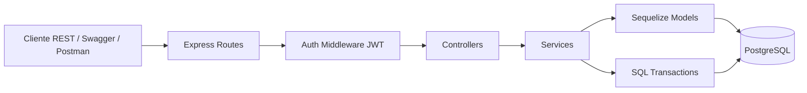
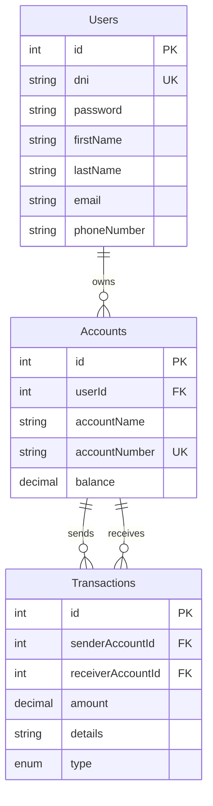
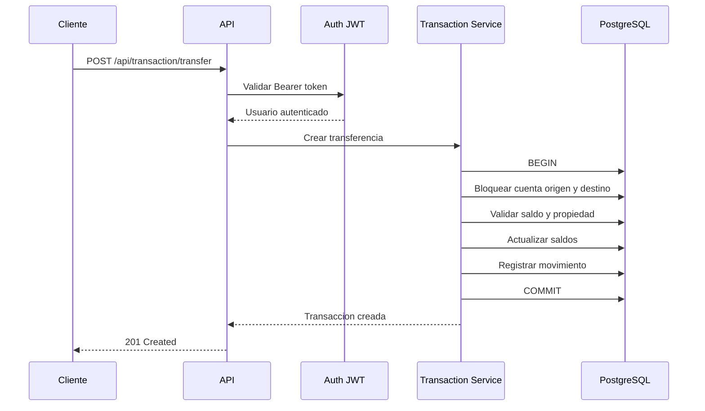

<div align="center">

# MazeBank API


</div>

RESTful API bancaria para gestionar usuarios, cuentas y movimientos financieros con autenticación JWT, PostgreSQL y operaciones transaccionales seguras.

**Demo local:** [http://localhost:3000](http://localhost:3000)  
**Swagger API Docs:** [http://localhost:3000/api-docs](http://localhost:3000/api-docs)  
**Memoria tecnica / JSDoc:** [docs/index.html](docs/index.html)

## Descripción

MazeBank API es el backend de una aplicacion bancaria desarrollada con Node.js, Express, Sequelize y PostgreSQL. Permite registrar usuarios, iniciar sesion, crear cuentas bancarias, consultar saldos y ejecutar depositos, retiradas y transferencias entre cuentas.

El proyecto esta dirigido a usuarios tecnicos, reclutadores o equipos de desarrollo que quieran revisar una API REST organizada con patron MVC, documentacion Swagger y despliegue reproducible mediante Docker Compose.

La necesidad principal que cubre es simular la logica critica de un banco: proteger credenciales, restringir operaciones privadas mediante token JWT, mantener la integridad de los saldos y registrar todos los movimientos en una tabla de transacciones.

## Evidencia Visual

### Arquitectura MVC



### Modelo de Datos



### Flujo de Transferencia



### Ejemplo de Respuesta JSON

```json
{
  "id": 42,
  "senderAccountId": 1,
  "receiverAccountId": 2,
  "amount": "250.00",
  "details": "Pago de alquiler",
  "type": "TRANSFER",
  "createdAt": "2026-05-04T20:30:00.000Z",
  "updatedAt": "2026-05-04T20:30:00.000Z"
}
```

## Características

- Registro y login de usuarios con contrasenas cifradas mediante bcrypt.
- Autenticacion JWT con expiracion corta de 1 hora.
- Gestion de cuentas bancarias por usuario autenticado.
- Numeros de cuenta generados automaticamente con formato `ES000001`.
- Depositos, retiradas y transferencias entre cuentas.
- Historial paginado de movimientos con filtros por tipo de transaccion.
- Proteccion de saldo: el balance solo cambia mediante operaciones transaccionales.
- Eliminacion de cuentas bloqueada cuando existe saldo pendiente.
- PostgreSQL inicializado con schema y datos de ejemplo.
- Documentacion interactiva con Swagger UI.
- Documentacion tecnica generada con JSDoc.
- Rate limiting y CORS configurados en Express.

## Estructura del Prototipo

Aunque el foco principal del proyecto es backend, el repositorio incluye una pequena vista renderizada con EJS y una API documentada.

- **home.ejs:** vista principal servida en `/`. Funciona como pantalla inicial de MazeBank.
- **api-docs:** interfaz Swagger disponible en `/api-docs` para probar y consultar los endpoints REST.
- **docs/index.html:** documentacion tecnica generada con JSDoc a partir de modelos, servicios, controladores y rutas.
- **pgAdmin:** panel web opcional disponible si se levanta Docker Compose, util para inspeccionar la base de datos PostgreSQL.

## Tecnologías Utilizadas

- Node.js
- Express 5
- PostgreSQL
- Sequelize
- Docker y Docker Compose
- JWT
- bcrypt
- Swagger / OpenAPI
- JSDoc
- EJS
- HTML5
- CSS3

## Enfoque Técnico

El desarrollo se ha planteado como una API REST organizada por responsabilidades, siguiendo una estructura cercana a MVC.

- Separacion entre rutas, controladores, servicios y modelos.
- Modelado relacional con Sequelize sobre PostgreSQL.
- Uso de migracion inicial mediante scripts SQL en `db/`.
- Autenticacion con middleware JWT en las rutas privadas.
- Uso de transacciones SQL para operaciones financieras atomicas.
- Uso de hooks de Sequelize para reforzar reglas de dominio.
- Documentacion de endpoints mediante Swagger.
- Documentacion interna mediante JSDoc.
- Vista EJS y CSS como prototipo visual minimo.

## Seguridad

MazeBank API incluye varias decisiones enfocadas a proteger datos y consistencia bancaria:

- **JWT con expiracion de 1 hora:** reduce la ventana de uso si un token queda expuesto.
- **bcrypt:** las contrasenas no se almacenan en texto plano.
- **defaultScope en usuarios:** el modelo `Users` excluye `password` por defecto en las consultas.
- **Middleware de autenticacion:** las rutas de cuentas y transacciones requieren `Authorization: Bearer <token>`.
- **Hooks en cuentas:** bloquean cambios directos sobre `balance` y `accountNumber`.
- **Validacion de borrado:** una cuenta con saldo distinto de cero no puede eliminarse.
- **Transacciones SQL:** depositos, retiradas y transferencias se ejecutan con `BEGIN`, `COMMIT` y `ROLLBACK`.
- **Bloqueo de filas:** las cuentas implicadas se consultan con lock para reducir problemas de concurrencia.
- **Rate limiting:** limite de 100 peticiones cada 5 minutos para mitigar abuso basico.

## Instalación

### Prerrequisitos

- Node.js 20 o superior.
- npm.
- Docker Desktop y Docker Compose.
- Git.

### 1. Clonar el repositorio

```bash
git clone https://github.com/Jaldekoa/mazebank.git
cd mazebank
```

### 2. Crear el archivo `.env`

Crea un archivo `.env` en la raiz del proyecto. No subas este archivo al repositorio.

```bash
PORT=3000
APP_HOST=mazebank-api
APP_PORT=3000

POSTGRES_NAME=mazebank_db
POSTGRES_USER=mazebank_user
POSTGRES_PASSWORD=change_me
POSTGRES_HOST=postgres
POSTGRES_PORT=5432

PGADMIN_HOST=mazebank-pgadmin
PGADMIN_EMAIL=admin@mazebank.local
PGADMIN_PASSWORD=change_me
PGADMIN_PORT=5050

JWT_SECRET=change_this_secret
```

Variables obligatorias:

- `PORT`
- `APP_HOST`
- `APP_PORT`
- `POSTGRES_NAME`
- `POSTGRES_USER`
- `POSTGRES_PASSWORD`
- `POSTGRES_HOST`
- `POSTGRES_PORT`
- `PGADMIN_HOST`
- `PGADMIN_EMAIL`
- `PGADMIN_PASSWORD`
- `PGADMIN_PORT`
- `JWT_SECRET`

### 3. Levantar el proyecto con Docker

```bash
docker compose up --build
```

Cuando los contenedores esten activos:

- API: [http://localhost:3000](http://localhost:3000)
- Swagger: [http://localhost:3000/api-docs](http://localhost:3000/api-docs)
- Health check: [http://localhost:3000/health](http://localhost:3000/health)
- pgAdmin: [http://localhost:5050](http://localhost:5050)

### 4. Instalacion local alternativa

Si ya tienes PostgreSQL disponible y las variables `.env` apuntan a tu base de datos:

```bash
npm install
npm run dev
```

Para ejecutar en modo normal:

```bash
npm start
```

Para regenerar la documentacion JSDoc:

```bash
npm run docs
```

## Endpoints Principales

| Metodo   | Ruta                              | Descripcion                  | Auth |
| -------- | --------------------------------- | ---------------------------- | ---- |
| `POST`   | `/api/user/register`              | Registrar usuario            | No   |
| `POST`   | `/api/user/login`                 | Iniciar sesion y obtener JWT | No   |
| `GET`    | `/api/user/me`                    | Consultar perfil             | Si   |
| `PATCH`  | `/api/user/me`                    | Actualizar perfil            | Si   |
| `DELETE` | `/api/user/me`                    | Eliminar usuario             | Si   |
| `GET`    | `/api/account`                    | Listar cuentas del usuario   | Si   |
| `POST`   | `/api/account`                    | Crear cuenta bancaria        | Si   |
| `GET`    | `/api/account/:accountNumber`     | Consultar una cuenta         | Si   |
| `PATCH`  | `/api/account/:accountNumber`     | Renombrar cuenta             | Si   |
| `DELETE` | `/api/account/:accountNumber`     | Eliminar cuenta sin saldo    | Si   |
| `GET`    | `/api/transaction/:accountNumber` | Historial de movimientos     | Si   |
| `POST`   | `/api/transaction/deposit`        | Realizar deposito            | Si   |
| `POST`   | `/api/transaction/withdraw`       | Realizar retirada            | Si   |
| `POST`   | `/api/transaction/transfer`       | Realizar transferencia       | Si   |

## Ejemplos Rápidos

### Registro

```bash
curl -X POST http://localhost:3000/api/user/register \
  -H "Content-Type: application/json" \
  -d '{
    "dni": "99999999Z",
    "password": "secret123",
    "firstName": "Alex",
    "lastName": "Rivera",
    "email": "alex@example.com",
    "phoneNumber": "600000000"
  }'
```

### Login

```bash
curl -X POST http://localhost:3000/api/user/login \
  -H "Content-Type: application/json" \
  -d '{
    "dni": "99999999Z",
    "password": "secret123"
  }'
```

### Crear cuenta

```bash
curl -X POST http://localhost:3000/api/account \
  -H "Content-Type: application/json" \
  -H "Authorization: Bearer TU_TOKEN" \
  -d '{
    "accountName": "Cuenta principal"
  }'
```

### Transferencia

```bash
curl -X POST http://localhost:3000/api/transaction/transfer \
  -H "Content-Type: application/json" \
  -H "Authorization: Bearer TU_TOKEN" \
  -d '{
    "senderAccountNumber": "ES000001",
    "receiverAccountNumber": "ES000002",
    "amount": 250,
    "details": "Pago de alquiler"
  }'
```

## Estructura del Proyecto

```text
mazebank/
├── db/                         # Schema SQL y datos iniciales
├── docs/                       # Documentacion JSDoc generada
├── public/                     # CSS e imagenes publicas
├── src/
│   ├── config/                 # Base de datos y Swagger
│   ├── controllers/api/        # Controladores REST
│   ├── middlewares/            # Auth JWT
│   ├── models/                 # Modelos Sequelize
│   ├── routes/                 # Rutas Express
│   ├── services/               # Logica de negocio
│   └── views/                  # Vistas EJS
├── docker-compose.yaml
├── Dockerfile
├── jsdoc.json
└── package.json
```

## Autor

- **Jon Aldekoa** - [GitHub](https://github.com/Jaldekoa)
